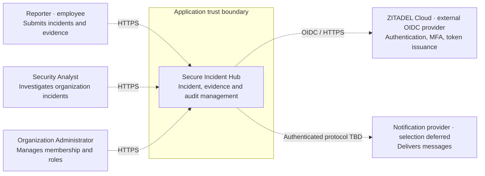
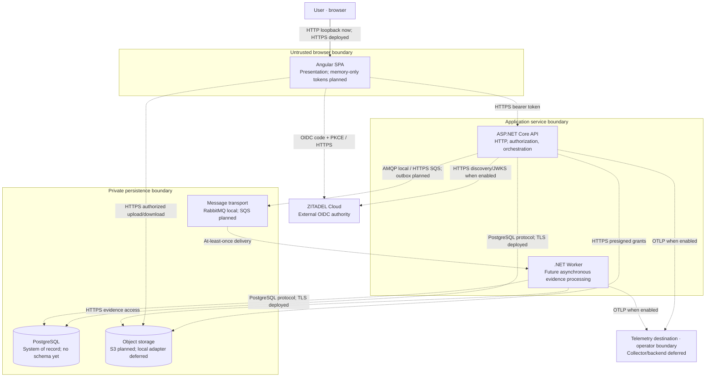

# Architecture baseline

The main application is a modular monolith. API and worker are separate hosts over shared application code, not independently owned microservices. Introduce module files with real slices rather than empty projects per module.

| Module        | Owns                                           | Collaboration                                                      |
| ------------- | ---------------------------------------------- | ------------------------------------------------------------------ |
| Identity      | External `(iss, sub)` key and identity mapping | Organizations resolves membership                                  |
| Organizations | Organizations, memberships, roles              | Authorizes tenant operations                                       |
| Incidents     | Lifecycle and assignment                       | References organization/evidence IDs; requests audit/notifications |
| Evidence      | Metadata and upload/processing lifecycle       | Uses storage/messaging ports; checks incident ownership            |
| Audit         | Append-oriented security/business history      | Accepts explicit events; grants no access                          |
| Notifications | Delivery intent and status                     | Consumes minimal events                                            |

Domain has no project dependencies. Application references Domain and defines external-system contracts. Infrastructure references Application and implements configuration/telemetry integrations. API and Worker are composition roots. Infrastructure SDKs, web types and persistence details cannot enter Domain/Application; architecture tests check dependencies. Avoid generic EF repositories and mediator frameworks.

## C4 System Context — intended product

Dashed relationships are planned. Only diagnostic HTTP and a static SPA exist in Phase 0.

## C4 Container

Compose services are independently available but not host readiness/test dependencies. No storage/database/messaging adapters are installed. The worker starts, waits for shutdown and emits lifecycle telemetry; it does not process messages.

## Planned AWS deployment

Angular assets: S3/CloudFront. API: ALB to ECS Fargate. Worker: ECS Fargate. Images: ECR. Data: RDS PostgreSQL/private S3. Messaging: SQS. Identity remains ZITADEL. OpenTelemetry routes to a selected monitoring backend; CloudTrail records cloud control-plane activity. IAM/STS, KMS and Secrets Manager protect access/secrets. WAF, GuardDuty and Config are optional after need/cost review.

All regional resources use `us-east-1`. Restricted Free-plan availability is unverified. No VPC, NAT, ALB, database, backend, IAM OIDC provider or AWS resource exists in Phase 0 Terraform. Lab cost limits and production-reference architecture remain separate future work. Unavailable Fargate must fail clearly, not trigger an EC2 fallback.
