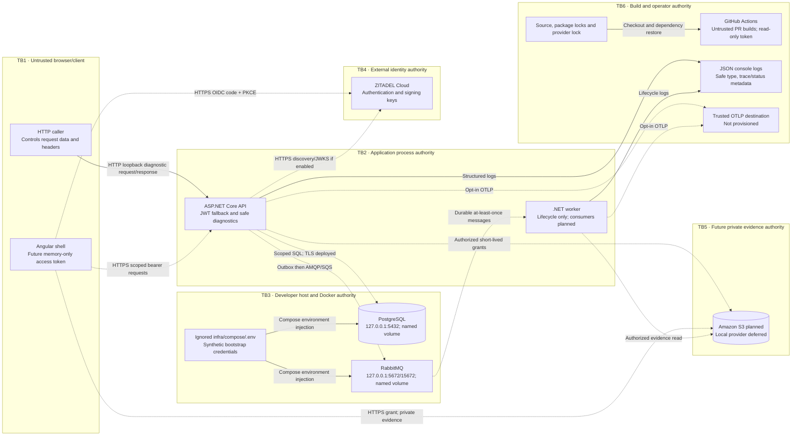

# Security data-flow diagram

Solid arrows are current local flows; dashed arrows are future or explicitly enabled integrations. Application hosts have no database, messaging or storage client in Phase 0. Module/project boundaries are not security sandboxes.

Future AWS control-plane authority is separate: a developer selects temporary local credentials, verifies STS identity, then separately reviews/authorizes resource changes. Phase 0 CI has no AWS authentication or deployment path. The two local services share a Docker network; no inter-service isolation or TLS is claimed.
